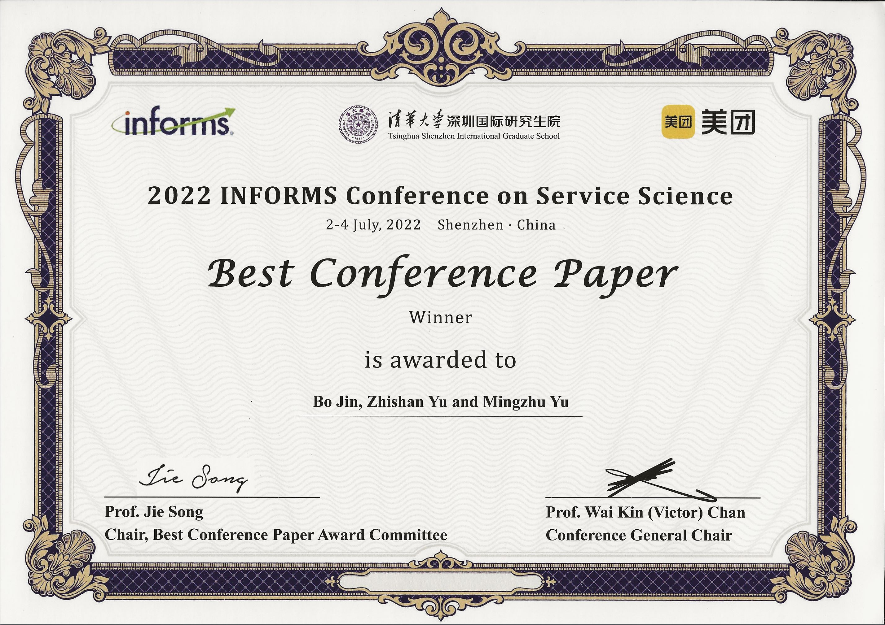

This project is part of the paper [Jin, B., Yu, Z., Yu, M. (2022). Inbound container remarshaling problem in an automated container terminal. [*Transportation Research Part E: Logistics and Transportation Review*](https://doi.org/10.1016/j.tre.2022.102938), 168, 102938].

This project is written in Java 8 with CPLEX 20.1.

The [previous version of the paper](https://doi.org/10.1007/978-3-031-15644-1_21) was awarded the Best Conference Paper at the 2022 INFORMS International Conference on Service Science (ICSS).

